# Agent轨迹洞察：Claude从劫持到字段解析

> 样本：`/Users/gaoyinghua/Downloads/2026-07-17.jsonl`，共533次模型调用。一行JSONL是一次模型调用，不是一条完整Agent轨迹。

本文分两部分：第一部分解释代理怎样透明劫持Claude API流量，以及API字段如何映射为落盘字段；第二部分解释这些调用可以分成哪些请求类型，System、User、Assistant和Tool分别来自哪里。

## 第一部分：如何劫持Claude轨迹

### 1. 代理插在哪里

Claude Code Harness先组装System、Messages和Tools，再由模型客户端调用Anthropic API。代理插在模型客户端与服务器之间，此时上下文已经完整：

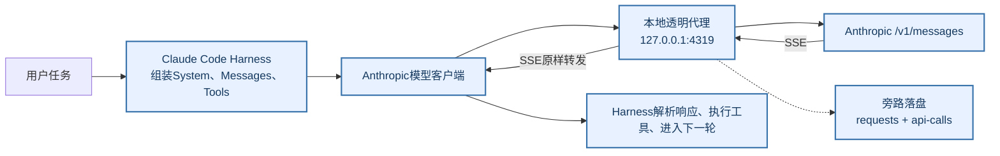

为什么要在这里截获：`system`和`tools`只存在于请求体，模型原始输出只存在于响应流；本地会话日志和Telemetry很难同时拿全两侧。

### 2. 如何接入，以及什么会被捕获

只需把Claude Code的API地址改到本地代理：

```text
ANTHROPIC_BASE_URL=http://127.0.0.1:4319

Claude Code → 本地代理 → https://api.anthropic.com
```

代理的边界很明确：

- 请求body原样发往Anthropic，SSE原样返回Claude Code；代理不参与Agent决策。
- 只捕获`POST */v1/messages`且`metadata.user_id`中能提取`session_id`的请求；其他流量仍转发，但不落盘。
- 请求头正常转发，但不写入磁盘，Authorization/OAuth凭证不会进入轨迹。
- 捕获失败只记录错误，不能阻断线上Agent；上游转发失败才返回502。

### 3. API字段如何映射到落盘字段

“劫持前后字段变化”更准确地说是**API字段到旁路落盘字段的映射**：模型真正收到的请求没有被代理改写。

| API原始字段或事件 | 落盘字段 | 处理方式 |
|---|---|---|
| 完整请求body | `request` | 原样保存`model/system/messages/tools/...` |
| HTTP状态码 | `status` | 直接记录 |
| `metadata.user_id`中的`session_id` | `session_id` | 解析JSON格式，兼容旧字符串格式 |
| `system + tools` | `sha` | 去掉billing block后计算指纹；用于聚类，不是调用ID |
| `system + messages`结构路径 | `thread_id` | 锚定本次调用路径里的首个Assistant节点 |
| 首次调用还没有Assistant | `thread_id_provisional=true` | 先写临时线程ID，后续离线归并 |
| SSE `message_start/content_block_*/message_delta` | `response` | 重建完整Message |
| SSE无法重建或非JSON错误正文 | `response_raw` | 兜底保留原文 |
| 捕获完成时间 | `ts` | 代理新增 |

SSE重建的核心映射：

| SSE事件 | `response`中的结果 |
|---|---|
| `message_start` | Message骨架、ID、model、初始usage |
| `content_block_start` | 创建`text/thinking/tool_use`等内容块 |
| `text_delta` | 追加`text` |
| `thinking_delta + signature_delta` | 追加`thinking + signature` |
| `input_json_delta` | 拼接并解析`tool_use.input` |
| `message_delta` | 更新`stop_reason`和`usage` |

一个简化的映射例子：

```text
请求中：
metadata.user_id = "{...\"session_id\":\"a238...\"}"
system + tools    = 完整提示词与35个工具定义
messages          = 当前完整历史

落盘后：
session_id = "a238..."                 ← 从metadata提取
sha        = "7a028e..."               ← system+tools计算
request    = {model, system, messages...}← 原始请求body
response   = {content, stop_reason, usage}← SSE重建
```

### 4. 为什么有两条落盘轨

| 文件 | 粒度 | 用途 |
|---|---|---|
| `requests/YYYY-MM-DD.jsonl` | `session_id + sha`去重后的`system + tools` | 快速分析Prompt/工具配置 |
| `api-calls/YYYY-MM-DD.jsonl.gz` | 每次模型调用一条完整`request + response` | 训练样本与完整轨迹重建 |

全量记录的核心结构：

```json
{
  "ts": 0,
  "session_id": "...",
  "sha": "system+tools指纹",
  "thread_id": "...",
  "status": 200,
  "request": {"model": "...", "system": [], "messages": [], "tools": []},
  "response": {"content": [], "stop_reason": "tool_use", "usage": {}}
}
```

## 第二部分：劫持轨迹如何解析

解析时要区分两个正交维度：

```text
调用级：主Agent / 标题生成 / 通用子Agent / WebFetch / Web Search
字段级：顶层System / Messages中的System、User、Assistant / Tool
```

### 1. 五类请求

| 请求类型 | 数量 | 作用 | 主训练集 |
|---|---:|---|---|
| 主Agent | 386 | 执行用户任务和调用工具 | 保留 |
| 标题生成 | 67 | 生成会话标题 | 过滤 |
| 通用子Agent | 50 | 执行主Agent委派的独立任务 | 与主Agent关联后保留 |
| WebFetch页面阅读 | 16 | 阅读已抓取的网页正文 | 作为工具子调用 |
| Web Search服务端调用 | 14 | 执行搜索并返回结果 | 作为工具子调用 |

为什么没有Read、Bash、Edit等“普通工具请求”：代理只记录发往`/v1/messages`的**模型调用**。普通工具由Claude Code Harness在本地直接执行，不会再次请求模型，因此不会单独形成一行JSONL；它们只留下两处痕迹：当前response中的`assistant.tool_use`，以及下一次模型请求中的`user.tool_result`。Agent、Web Search和部分WebFetch会额外发起模型请求，所以才有独立轨迹。

这五类请求来自同一条Agent运行链路。蓝色节点都会调用模型并被代理落盘；灰色节点只在本地执行，不会单独形成模型轨迹。

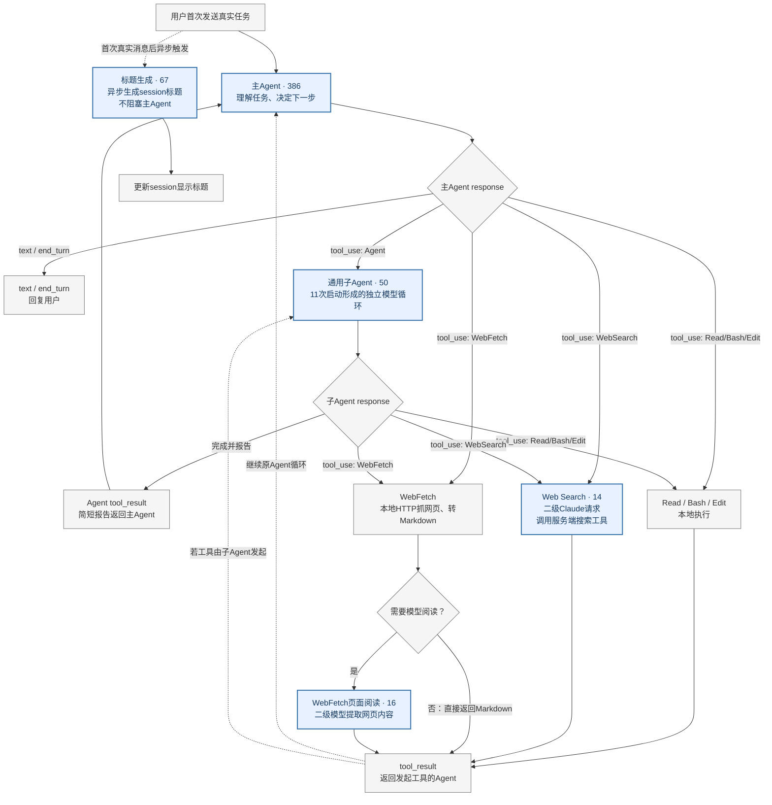

因此，386、50、16和14统计的是**模型调用次数**，不是session或工具启动次数。标题生成通常只在首条真实消息后触发一次；主Agent和子Agent每拿到一个工具结果，都可能继续发起下一次模型调用。

请求类型不能按模型判断：Haiku、Sonnet、Opus都可能承担不同类型。应联合判断System前缀、Messages、Tools和输出格式。

### 2. 主Agent（386）

负责真正的Agent循环：读取上下文、调用工具、接收工具结果，最后回答用户。

下面用一个典型主Agent请求说明System的组成。三列始终是：**①原始文字 → ②注入方/概念 → ③请求位置**。蓝色表示Claude Code Harness，橙色表示飞书侧（含Bridge）；原始文字是轨迹中的真实节选。每张图的占比以该图列出的字段字符总数为分母，只代表该样本；Tools按紧凑JSON计算字符数。

#### `request.system[0]`

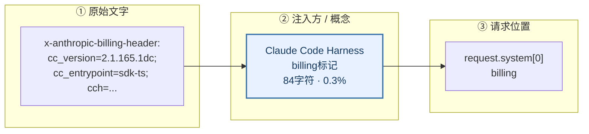

#### `request.system[1]`

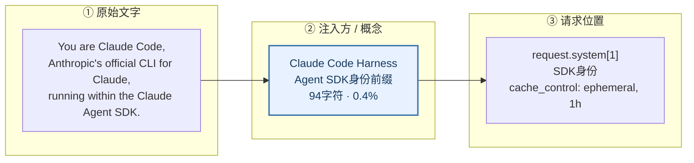

#### `request.system[2]`

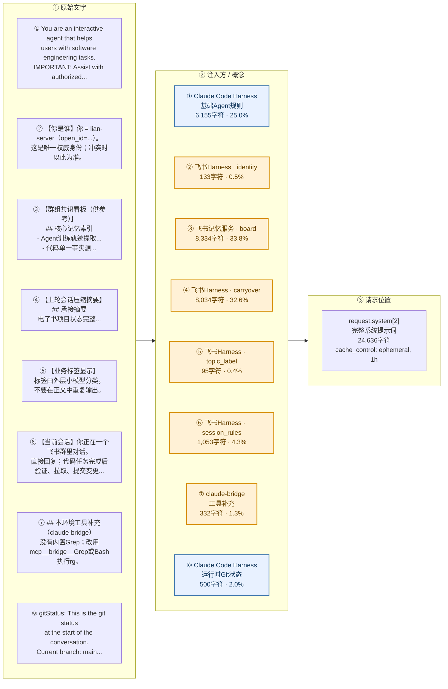

`system[2]`不是新格式，而是八段普通文本最终拼进同一个text block。

#### `request.messages[]`中的动态System信息

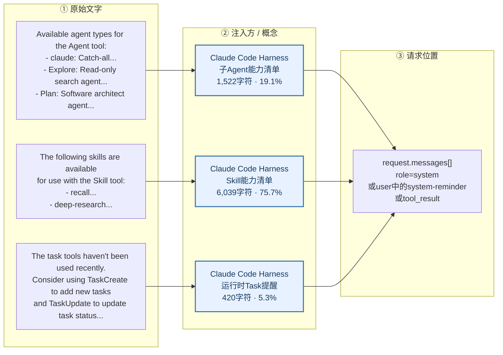

顶层System是本次调用的全局提示词；Messages里的动态System信息进入对话时间线，旧提醒还会随完整历史重复出现。

##### Opus 4.8允许在Messages中途插入System

这是新旧模型最重要的结构差异之一：

| 动态信息 | Sonnet 4.6 / Haiku 4.5 | Opus 4.8 |
|---|---|---|
| Agent列表 | `role=user + <system-reminder>` | 中途`role=system` |
| Skill列表 | `role=user + <system-reminder>` | 中途`role=system` |
| Task提醒 | `role=user + <system-reminder>`，有时合入`tool_result.content` | 中途`role=system` |
| `claudeMd + userEmail + currentDate` | `role=user + <system-reminder>` | 仍是`role=user + <system-reminder>` |

`4_claude.json`是一条典型Opus 4.8主Agent请求：

```text
messages[0].role=user
  → claudeMd + userEmail + currentDate

messages[1].role=system
  → Available agent types for the Agent tool...
  → The following skills are available for use with the Skill tool...

messages[12].role=system
  → The task tools haven't been used recently...
```

Agent和Skill列表不是消失了，而是从首个user turn移到了独立System turn。顶层`request.system[]`仍承载整次调用的全局规则；`messages[].role=system`承载运行过程中按时间插入的动态信息。

因此解析器不能再假设`messages`只按user/assistant交替出现，也不能只搜索`<system-reminder>`：

```text
旧模型：role=user + <system-reminder>
Opus 4.8：role=system
统一语义：Claude Harness动态注入
```

顶层三个block各自是：

```text
system[0]：billing、Claude Code版本和入口
system[1]：You are Claude Code... SDK身份
system[2]：基础规则 + 飞书上下文 + Bridge提示 + Git状态
```

识别特征：

- `system[2]`以 `You are an interactive agent...` 开头；
- 定义约28—36个工具；
- Messages是不断增长的完整历史；
- response可能是`tool_use`、`end_turn`或`max_tokens`。

### 3. 标题生成（67）

只为会话生成标题，不执行用户任务。

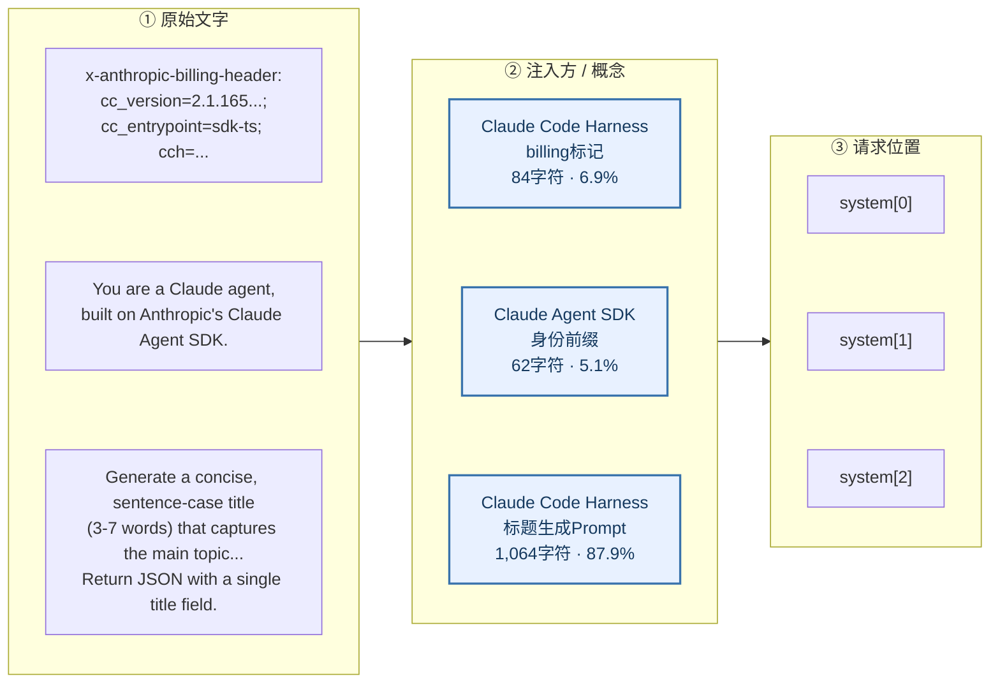

识别特征：

- `system[2]`以 `Generate a concise, sentence-case title` 开头；
- 只有一条user message，内容包在`<session>`中；
- `tools=[]`；
- 固定输出`{"title":"..."}`，全部以`end_turn`结束。

### 4. 通用子Agent（50）

这50条不是“工具选择器”，而是主Agent通过`Agent`工具启动的独立执行轨迹。11次子Agent启动，共产生50次内部模型调用。

#### 顶层`request.system[]`

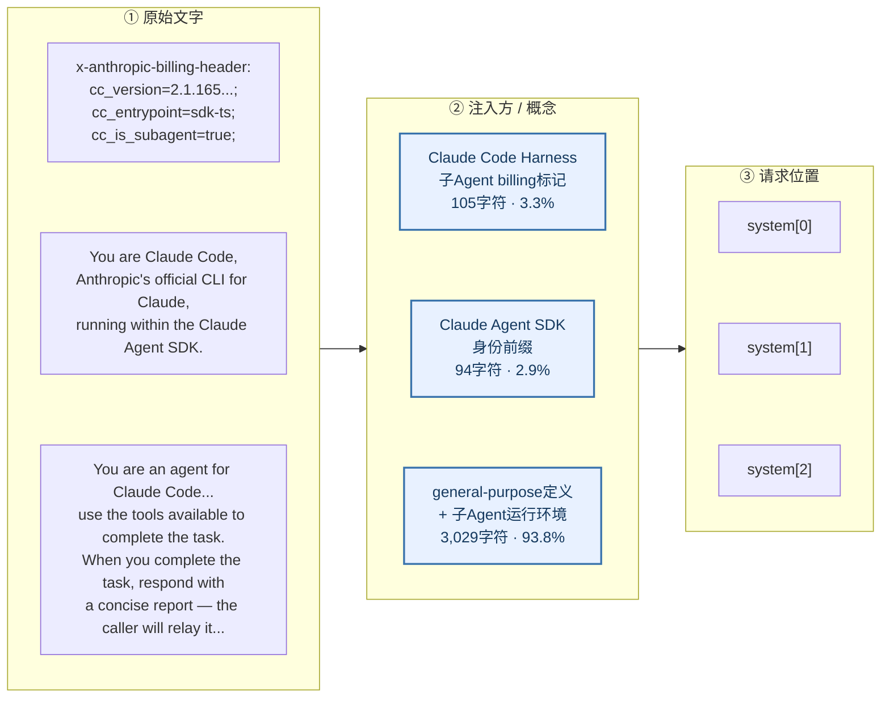

#### `request.messages[].role=system`

子Agent没有`Agent`工具，所以不会收到Agent列表。Opus 4.8子Agent的中途System只有Skill列表和按条件触发的Task提醒：

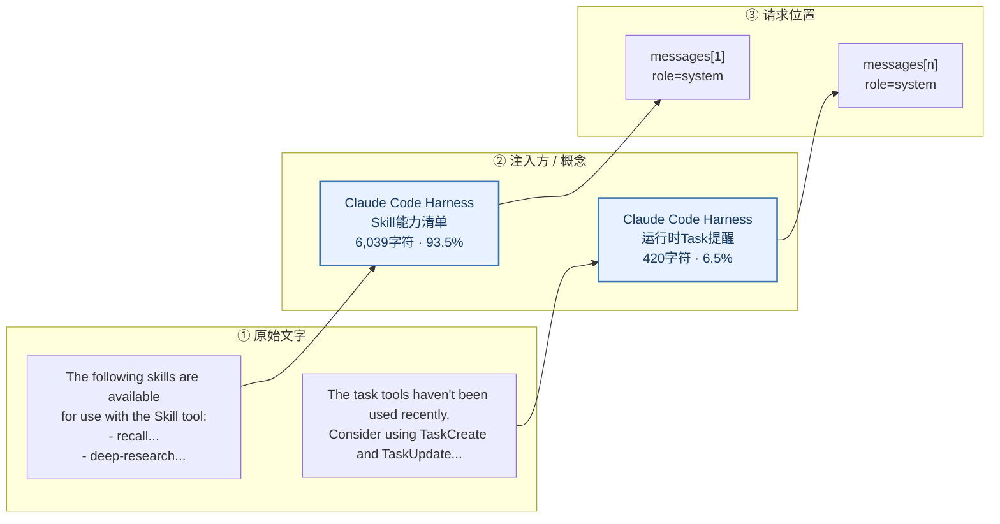

50条子Agent中，13条Opus 4.8请求出现Skill System，6个历史位置出现Task System。37条Sonnet 4.6的Skill列表降级在`role=user + <system-reminder>`中，留到User字段一节再解释。

子Agent与主Agent的关系：

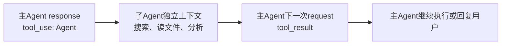

| 主Agent | 通用子Agent |
|---|---|
| 直接处理用户任务 | 处理主Agent委派的子任务 |
| 携带主对话历史 | 不继承主对话，只接收委派Prompt和注入上下文 |
| 直接回复用户 | 最终报告返回caller |
| 使用主Agent System | 使用general-purpose System |
| billing无子Agent标记 | `cc_is_subagent=true` |

50条中的`system[2]`只有3种版本，固定部分完全相同，差异只来自cwd、模型、知识截止时间和Git快照。

#### 一个完整父子例子

1. 原轨迹第100行：主Agent返回`tool_use`，`name=Agent`，ID为`toolu_018a...`。
2. 第101行：产生子Agent请求；其user prompt与`Agent.input.prompt`完全一致。
3. 第103行：同一ID以`tool_result.tool_use_id`返回主Agent。

```text
主Agent tool_use(Agent)
  → 子Agent独立模型调用
  → 主Agent tool_result
```

父调用与返回结果可用`tool_use.id`精确配对；子Agent请求本身不带这个ID，只能用相同`session_id`缩小范围，再结合完全一致的Prompt和时间顺序关联。

### 5. WebFetch页面阅读（16）

WebFetch先由Claude Code直接抓取网页并转成Markdown，再调用模型提取内容。这16条记录的是第二步，不是HTTP抓取过程。

#### 顶层`request.system[]`

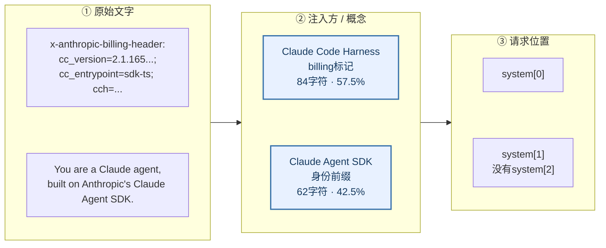

16条WebFetch页面阅读请求的`messages[].role=system`均为空；网页正文和阅读问题位于User字段，留到User部分分析。

识别特征：

- System只有两个block；
- user message以 `Web page content:` 开头；
- `tools=[]`；
- response是基于网页正文生成的文本；
- 全部只有一次模型iteration；
- 15条由子Agent触发，1条由主Agent触发。

```text
WebFetch工具 → HTTP抓网页 → 转Markdown → 二级模型阅读 → tool_result
```

短小、预批准的Markdown可以直接返回，不一定产生二级模型调用。

### 6. Web Search服务端调用（14）

Anthropic原生Web Search不是独立搜索REST接口，而是Messages API中的服务端工具，因此Claude Code需要再发起一次最小模型请求。

#### 顶层`request.system[]`

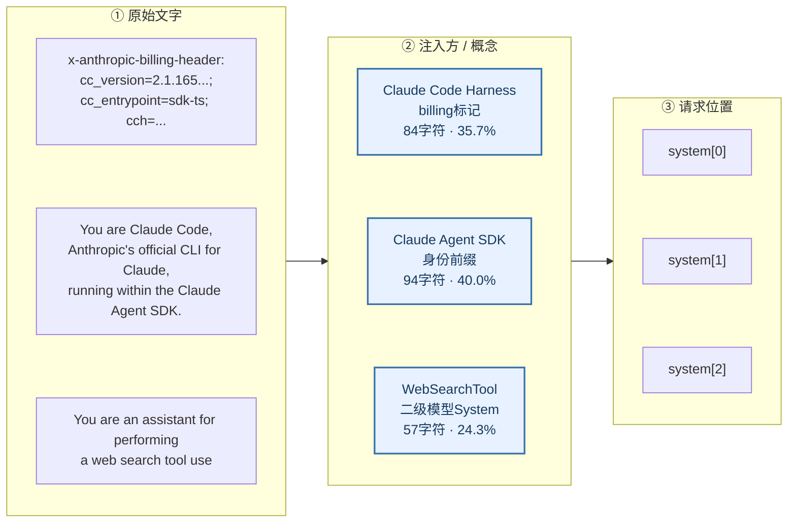

14条Web Search请求的`messages[].role=system`也均为空；搜索词位于User字段，`web_search`定义位于`tools[0]`。

识别特征：

- user message是 `Perform a web search for the query: ...`；
- 请求只定义`web_search`工具；
- response包含`server_tool_use`和`web_search_tool_result`；
- `usage`同时记录模型token和`web_search_requests`。

```text
主Agent/子Agent调用WebSearch
  → 二级Claude请求声明web_search
  → Anthropic服务端调用搜索引擎
  → 搜索结果返回模型
  → 模型生成文本并返回外层Agent
```

搜索发生在搜索引擎；模型负责生成搜索请求并处理结果。若改走Tavily或Brave独立API，则不会形成这种Claude模型轨迹。

### 7. System有两个请求位置

| 位置 | 作用 | 典型内容 |
|---|---|---|
| `request.system[]` | 本次模型调用的全局提示词 | billing、SDK身份、主Agent/子Agent/标题/WebSearch规则 |
| `request.messages[].role=system` | 对话运行中按时间插入的动态控制信息 | Opus 4.8的Agent、Skill、Task提醒 |

五类请求的顶层System形态：

| 请求类型 | `request.system[]` |
|---|---|
| 主Agent | 3个block；`system[2]`是完整主Agent规则 |
| 标题生成 | 3个block；`system[2]`是标题Prompt |
| 通用子Agent | 3个block；`system[0]`含`cc_is_subagent=true`，`system[2]`是子Agent规则 |
| Web Search | 3个block；`system[2]`是搜索Prompt |
| WebFetch | 只有2个block，没有`system[2]` |

Sonnet/Haiku不支持中途System时，动态控制信息会降级到`role=user + <system-reminder>`；解析训练数据时仍应归一为System语义。

### 8. `role=user`里不只有用户输入

`role`只是wire协议中的消息位置，不代表内容来源。样本中的`role=user`至少包含以下五类：

| 原始文字节选 | 注入方/含义 | 请求位置 |
|---|---|---|
| `[本条消息由「廉莲」（open_id=...）发出。] 我的网页好像出问题了` | 🟠 飞书Harness：真实用户消息及发言人包装 | `role=user → text` |
| `<system-reminder> As you answer... # claudeMd ... # userEmail ... # currentDate ...` | 🔵 Claude Harness：共享上下文；主Agent和子Agent共436条 | `role=user → text` |
| `<system-reminder> Available agent types... / skills... / task tools haven't...` | 🔵 Claude Harness：旧模型的动态System降级形式 | `role=user → text`或`tool_result.content` |
| `type=tool_result, tool_use_id=toolu_...` | 🔵 Claude Harness：Read、Bash等工具执行结果 | `role=user → tool_result` |
| `<session>...</session>`、`Perform a web search...`、`Web page content:...` | 🔵 Claude Harness：标题、WebSearch、WebFetch二级调用输入 | `role=user → text` |

#### 例1：子Agent首条`user`包含三种来源

Sonnet子Agent的一条真实请求：

```text
request.system[0]：cc_is_subagent=true

request.messages[0].role=user
  content[0]：<system-reminder>Skill列表</system-reminder>
  content[1]：<system-reminder>claudeMd + userEmail + currentDate</system-reminder>
  content[2]：Read these files completely...       ← 主Agent委派任务
```

三段wire role相同，语义来源却不同。到Opus 4.8，Skill列表改为独立`role=system`，结构更干净。

#### 例2：Agent列表藏在`tool_result`末尾

```text
request.messages[2].role=user
  content[1].type=tool_result
  content[1].content=
    "...Read工具返回内容...

    <system-reminder>
    Available agent types for the Agent tool:
    - claude...
    - Explore...
    - general-purpose...
    </system-reminder>"
```

Agent列表不是Read的返回值。旧模型不支持中途System时，Harness把相邻的reminder合并到最后一个`tool_result.content`，避免额外的`Human:`边界。它只是借工具结果搭车。

解析器不能只看role，也不能把整个`tool_result.content`都当成环境观察；应拆出其中的`<system-reminder>`。建议至少保存：

```text
wire_role + content_type + semantic_source
```

### 9. `role=assistant`表示模型本轮输出

请求里的`messages[].role=assistant`是历史输出；当前调用的新输出位于顶层`response`。Claude响应只有一个角色`role=assistant`，模型回复、reasoning和工具调用通过`content[].type`区分。

```json
{
  "id": "msg_...",
  "type": "message",
  "role": "assistant",
  "model": "claude-...",
  "content": [],
  "stop_reason": "tool_use | end_turn | max_tokens",
  "usage": {}
}
```

| 顶层字段 | 含义 |
|---|---|
| `id/model` | 本次模型响应ID和实际模型 |
| `role` | 固定为`assistant` |
| `content[]` | 本轮生成的reasoning、文本或工具调用 |
| `stop_reason` | 等待工具、正常结束或被截断 |
| `usage` | 输入、输出、缓存和服务端工具用量 |

`response.content[]`与历史Assistant消息使用相同的内容块结构：

| 内容块 | 含义 | 后续动作 |
|---|---|---|
| `thinking` | 模型内部推理，通常带`signature` | 与可见文本分开保存 |
| `text` | 给用户的回答、子Agent报告或工具调用前说明 | `end_turn`时通常是最终回答 |
| `tool_use` | 要求Claude Harness执行客户端工具 | 用`id`等待下一次`tool_result.tool_use_id`返回 |
| `server_tool_use` | 要求Anthropic服务端执行工具 | Web Search内部使用 |
| `web_search_tool_result` | 服务端搜索结果 | 继续由同一次模型调用生成文本 |

典型本地工具调用：

```json
{
  "type": "tool_use",
  "id": "toolu_01...",
  "name": "Bash",
  "input": {"command": "pytest"}
}
```

对应的下一轮输入：

```json
{
  "role": "user",
  "content": [{
    "type": "tool_result",
    "tool_use_id": "toolu_01...",
    "content": "..."
  }]
}
```

`stop_reason`帮助判断本轮状态：`tool_use`表示等待客户端执行工具，`end_turn`表示模型结束当前回答，`max_tokens`表示输出被截断。重建轨迹时只把当前`response`追加一次，不能把下一条请求中重复携带的Assistant历史再次计入。

### 10. 四种工具执行路径

`request.tools[]`只是工具定义；真正的调用出现在assistant的`tool_use`中。

| 工具 | 执行位置 | 是否产生二级模型轨迹 |
|---|---|---:|
| Read、Bash、Edit | Claude Code本地执行 | 否 |
| Agent | 启动独立子Agent循环 | 是 |
| WebSearch | Claude API服务端工具 | 是 |
| WebFetch | 本地抓网页后交给模型阅读 | 条件产生 |

普通本地工具闭环：

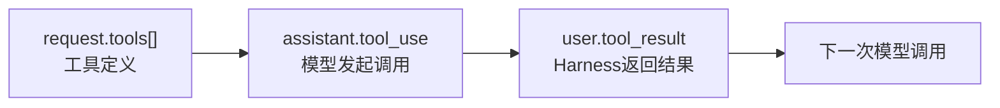

`tool_use.id`必须与`tool_result.tool_use_id`配对。Web Search内部另有一组服务端配对：`server_tool_use.id → web_search_tool_result.tool_use_id`。

### 11. 轨迹重建原则

同一thread的后续请求会重复携带完整历史。正确做法是按`thread_id + ts`排序，比较相邻请求，只提取新增消息和当前response。

最终归一化顺序：

```text
请求分类 → System标注 → Messages语义分类 → Tool配对 → 历史去重 → 轨迹输出
```
