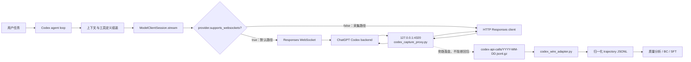
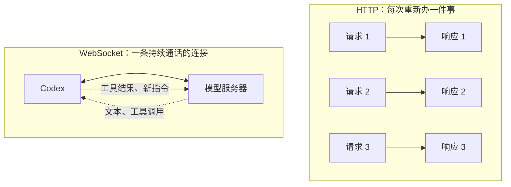
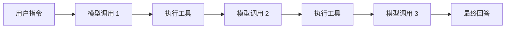
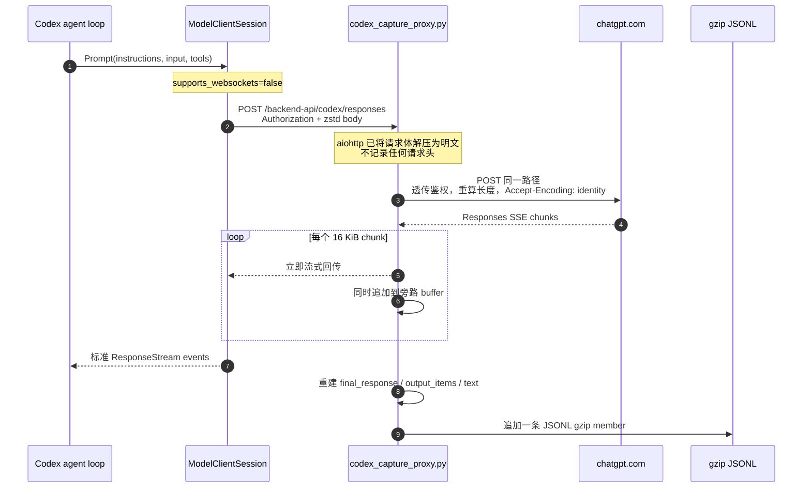
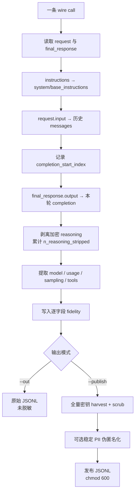

# Agent 轨迹洞察（一）：Codex

> 本文解释两件事：Codex 的模型流量在什么位置被“劫持”，以及捕获到的 Responses wire 记录如何被归一化为可分析、可用于行为克隆（BC）/SFT 的轨迹。
>
> 代码基线：`openai-codex` commit `2f7d89b1419bf7064346855b0acde23514b1ebc5`（2026-07-13）。

## 结论先行

这套方案没有修改 Codex 的 agent loop、上下文组装、工具执行或 OAuth 刷新逻辑，也不是 TLS MITM。它利用 Codex 已有的 model provider 配置，在**模型客户端选择传输协议和构造 Responses 请求 URL 的边界**插入一个本地透明代理：

1. 自定义 provider 设置 `supports_websockets=false`，使 Codex 不走 Responses WebSocket，直接进入 HTTP Responses 分支；
2. provider 的 `base_url` 指向 `127.0.0.1:4320/backend-api/codex`，于是 `POST .../responses` 先到本地代理；
3. 代理把请求原样转发到 `https://chatgpt.com`，同时旁路记录请求 payload 和响应 SSE；
4. `codex_wire_adapter.py` 把每次 `/responses` 调用转换为一条 `context → completion` 轨迹，统一消息角色、工具调用、usage、采样参数和保真度标记。

因此，更准确的表述不是“侵入 Codex 内部埋点”，而是：

> **在 Codex 的 Responses transport/provider seam 上做配置型流量改道，再以透明反向代理旁路采集。**

## 1. 三份核心代码各自负责什么

| 代码 | 职责 | 所在阶段 |
|---|---|---|
| `openai-codex/` | 决定 provider、base URL、ChatGPT OAuth、Responses WebSocket/HTTP 分支，并组装真实请求 | Codex 运行时 |
| `trajectory-collect/scripts/codex_capture_proxy.py` | 透明转发 HTTP 流量，旁路捕获 `/responses` 请求和 SSE 响应 | 在线采集 |
| `trajectory_extract/codex_wire_adapter.py` | 把每条 wire call 转为统一的 OpenAI-messages 形态，并按需脱敏发布 | 离线归一化 |

完整链路如下：



## 2. 劫持到底插在 Codex 的什么位置

### 2.1 第一刀：在 transport capability gate 关闭 WebSocket

Codex 的 `ModelClientSession.stream()` 优先尝试 Responses WebSocket，但是否启用由 provider 能力位控制：

- `responses_websocket_enabled()` 在 `provider.supports_websockets == false` 时直接返回 `false`；
- `stream()` 因而跳过 `stream_responses_websocket()`；
- 随后进入 `stream_responses_api()`，即 HTTP `POST /responses` 分支。

这不是“先让 WebSocket 失败再抓 fallback”，而是**在发起请求前通过 provider capability 明确选择 HTTP**。相应源码位置：

- `openai-codex/codex-rs/core/src/client.rs:926`：WebSocket 能力判断；
- `openai-codex/codex-rs/core/src/client.rs:1774`：WS/HTTP 总分流；
- `openai-codex/codex-rs/core/src/client.rs:1395`：HTTP Responses 实现。

#### 如果继续走 WebSocket，就一定无法捕获吗？

**不是原理上不能，而是当前这份代理抓不到。**原因要分两种情况看：

1. **使用默认 ChatGPT provider URL**：Codex 会直接建立到 ChatGPT 的 `wss://.../responses` 长连接，流量根本不经过 `127.0.0.1:4320`，本地代理自然看不到。
2. **把 provider base URL 指向本机，但仍声明支持 WebSocket**：Codex 会把 `http://127.0.0.1:4320/.../responses` 自动转换为 `ws://127.0.0.1:4320/.../responses`。流量虽然到了本机，但现有 `codex_capture_proxy.py` 只实现普通 HTTP 请求和 SSE 响应转发，没有实现 WebSocket Upgrade、双向 frame relay 和 frame 级落盘，因此仍不能正确代理和采集。

当前捕获器的数据模型也明确只认：

```text
POST .../responses → 一个 JSON request body → 一条 SSE response stream
```

而 WebSocket 的数据模型是：

```text
一次 HTTP 101 Upgrade → 一条可跨多次调用复用的长连接
                      → client 发送 response.create JSON frame
                      ← server 返回多条 response.* JSON frame
```

HTTP 模式下“一次 POST 就是一条 call”，边界天然清楚；WebSocket 模式下，连接边界不等于调用边界，还需要按 `response.create`、response id、终止事件、重连和 prewarm frame 重新拼 call。

如果要保留 WebSocket 也可以另写一套 WS-aware capture relay，它至少需要：

- 接受 Codex 的 WebSocket Upgrade；
- 再向 ChatGPT 建立上游 `wss` 连接；
- 双向透明转发 text/binary/ping/pong/close frame；
- 从出站 `response.create` frame 提取 instructions、input、tools；
- 从入站 `response.*` frame 重建 output、usage 和结束状态；
- 处理连接复用、prewarm（`generate=false`）、断线重连和一次连接内的多个 response；
- 继续保证鉴权 header 只透传、不落盘。

所以设置 `supports_websockets=false` 的真正意义是：**把流量降到现有采集器已经完整支持、且每次调用边界天然明确的 HTTP POST + SSE 协议**，而不是声称 WebSocket 天生无法观测。

#### WebSocket 和 HTTP Responses 的运行差异

两条路径承载的核心 Responses 语义相同，都可以流式返回 `response.*` 事件。差异主要不在“能否流式”，而在**连接和上下文如何复用**：

| 维度 | HTTP POST + SSE | Responses WebSocket |
|---|---|---|
| 通信形态 | 一次 POST 对应一条响应流 | 一次 Upgrade 后保持双向长连接 |
| 请求单位 | 每次调用发送一个 HTTP body | 每次调用发送一个 `response.create` frame |
| 响应单位 | SSE `data:` event | WebSocket JSON frame |
| 连接复用 | HTTP client 可复用底层 TCP/TLS，但每次仍是独立 HTTP request | Codex 显式缓存并复用同一个 Responses WS connection |
| 首次请求准备 | 正常发起 POST | 可提前 preconnect/prewarm，正式请求到来时复用连接 |
| 多轮上下文 | 当前采集路径看到每次请求的完整 `input` | 若上下文是上一轮的严格扩展，可发 `previous_response_id + incremental input` |
| 调用边界 | POST 开始到 SSE 结束，天然明确 | 必须按 `response.create`、response id 和完成事件切分 |
| 代理实现难度 | 普通反向代理加 SSE buffer 即可 | 需要 Upgrade、双向 frame relay 和有状态重建 |

给非网络背景的同事，可以把 HTTP 理解成“每次办事都单独提交一张表”，把 WebSocket 理解成“电话接通后保持通话”：



#### 为什么 Codex 原版优先选择 WebSocket

当前源码没有一句产品说明直接写“选择 WebSocket 是为了降低多少毫秒”，但实现明确围绕以下优化设计；“降低交互延迟和重复传输”是由这些机制可以直接支持的工程判断：

1. **连接预热**：Codex 可先发送 `generate=false` 的 v2 `response.create`，完成连接与服务端状态准备，但不做正式生成。用户请求真正开始时可以复用该连接和 warmup response id。
2. **长连接复用**：`ModelClientSession` 缓存 WebSocket connection。一次 turn 中可能发生多次“模型输出工具调用 → 本地执行工具 → 把结果交回模型”，无需为每一步重新建立 WS 会话。
3. **增量发送上下文**：当新请求的 input 是上一请求及其 response items 的严格扩展，Codex 会设置 `previous_response_id`，并只发送新增 item。例如上一轮已经发送过 user message 和 assistant tool call，下一轮可以只发新的 tool result，而不是重复上传全部历史。
4. **服务端连续性**：Codex保存 `x-codex-turn-state` 等 turn 级状态用于 sticky routing，使连续请求更容易落在兼容的服务端上下文上。
5. **仍保留 HTTP fallback**：若 provider 不支持 WebSocket、服务端要求切换，或 WS 失败达到回退条件，Codex仍能使用 HTTP Responses，不把可用性押在单一传输上。

这对 coding agent 特别有价值，因为一次用户任务通常不是“一问一答”，而是：



WebSocket 把这串高频模型调用放在可预热、可复用、可增量续接的通道上。需要注意，增量传输主要减少客户端重复上传和协议开销，**不等于模型少看了历史，也不能据此推断 token 计费一定下降**；服务端仍需恢复完整上下文来完成推理。

对轨迹采集而言，这也解释了为什么强制 HTTP 很方便：HTTP 请求里有完整上下文，天然得到一条独立的 `(context → completion)` 样本；若直接采 WebSocket，后续 frame 可能只有 `previous_response_id + delta`，采集器必须维护连接级状态，把多个 frame 和先前响应重新拼成模型当时真正可见的完整上下文。

### 2.2 第二刀：在 provider base URL 把 HTTP 请求导向本机

HTTP 分支本身仍然只是 Codex 的标准 Responses client。真正决定请求发往哪里的，是 `ModelProviderInfo::to_api_provider()`：

- provider 显式设置了 `base_url` 时，Codex优先使用该值；
- 未设置时，ChatGPT 登录态才回落到内置的 ChatGPT Codex URL；
- Responses client 再在 base URL 后拼接 `responses` endpoint。

因此，按当前源码最直接、最可验证的配置形态是：

```toml
model_provider = "proxycap"

[model_providers.proxycap]
name = "proxycap"
base_url = "http://127.0.0.1:4320/backend-api/codex"
wire_api = "responses"
requires_openai_auth = true
supports_websockets = false
```

这里两个配置缺一不可：

- `supports_websockets=false` 解决“走哪种传输”；
- `base_url=http://127.0.0.1:4320/...` 解决“HTTP 发到哪里”。

`requires_openai_auth=true` 让 provider 继续使用 Codex 的 OpenAI/ChatGPT 登录态。OAuth bearer token 和账号头由 Codex 的 auth provider 附加，代理只负责透传；token 刷新仍由 Codex 自己完成。

### 2.3 第三刀：代理只在 `/responses` 上旁路取证

`codex_capture_proxy.py` 对所有路径都可以透传，但只有同时满足以下条件才捕获：

```text
method == POST && path.endswith("/responses")
```

所以健康检查或其他后端请求不会混进轨迹数据。捕获点位于：

```text
Codex 已完成 instructions/input/tools 组装
                    ↓
            HTTP 请求已经序列化
                    ↓
        [本地代理在这里复制 request/response]
                    ↓
             ChatGPT Codex backend
```

这也是其保真度较高的原因：捕获内容就是模型端实际收到的逻辑 payload，而不是事后从 UI 日志反推。

## 3. 一次模型调用如何穿过代理



### 3.1 请求侧处理

代理调用 `request.read()` 读取 body。Codex 的请求可使用 zstd；aiohttp server 已按 `Content-Encoding` 解压，所以此时拿到的是 JSON 明文。转发时代理必须移除：

- 原来的 `Content-Encoding`，避免上游把明文再次当 zstd 解压；
- `Host`、`Content-Length`、`Transfer-Encoding` 等 hop-by-hop/连接级头，由新的 HTTP 栈重建。

其余头，包括 `Authorization`，原样传给上游。代理只落一个布尔值 `had_auth`，**不落任何 header，也不落 bearer token**。

### 3.2 响应侧处理

代理一边把上游 chunk 写回 Codex，一边把同一批字节复制到 buffer。这样在线响应优先，采集是旁路行为：

- 转发失败：显式返回 `502 proxy_error`；
- 捕获/落盘失败：响应已经返回给 Codex，只记录 `capture-ERROR`，不让观测故障拖垮 agent。

上游响应按内容而非 `Content-Type` 判断是否为 SSE，因为实际 endpoint 的响应头不一定声明 `text/event-stream`。只要正文同时出现 `data:` 和 `response.`，就尝试解析 Responses 事件。

### 3.3 为什么要同时保存重建结果和 `response_raw`

Responses 是事件流，最终有用信息分散在不同事件中：

- `response.output_text.delta`：正文增量；
- `response.reasoning_summary_text.delta` / `response.reasoning_text.delta`：若服务端提供，则拼接 reasoning sidecar；
- `response.output_item.done`：完整的 message、function call、reasoning item；
- `response.completed` / `incomplete` / `failed`：最终 response、状态和 usage。

当前 ChatGPT 后端的 `response.completed.response.output` 可能为空，因此代理使用 `response.output_item.done` 收集到的 `output_items` 回填。但它仍保留 `response_raw`，保证重建器即使漏识别新事件，也可以从原始 SSE 重放，而不是永久丢失。

## 4. 原始捕获记录是什么样

每次 `/responses` 调用写成一行，按日期追加到：

```text
$TRAJ_DATA_DIR/codex-api-calls/YYYY-MM-DD.jsonl.gz
```

核心结构是：

```json
{
  "ts": 1780000000.0,
  "path": "/backend-api/codex/responses",
  "status": 200,
  "had_auth": true,
  "request": {
    "model": "...",
    "instructions": "...",
    "input": [],
    "tools": [],
    "reasoning": {}
  },
  "response": {
    "final_response": {},
    "text": "...",
    "reasoning": null,
    "output_items": [],
    "events_seen": 123
  },
  "response_raw": "event: ...\ndata: ..."
}
```

这里的粒度是 **per API call**：一个 `.jsonl.gz` 文件包含多次调用，每一行才是一条独立轨迹候选。文件边界只是日期/存储边界，不是会话边界。

## 5. 轨迹归一化具体做了哪些事

`codex_wire_adapter.py` 的目标不是简单改字段名，而是把 Responses item 流变成统一、可切分、可审计的 trajectory record。



### 5.1 建立单次调用的真实训练边界

归一化消息按以下顺序构造：

```text
messages = [system instructions] + request.input + final_response.output
```

在追加 output 之前记录：

```text
completion_start_index = len(messages)
```

于是：

```text
messages[:completion_start_index]   = 本次请求的完整输入上下文
messages[completion_start_index:]   = 本次模型产生的 completion / target
```

这是 wire call 的真实边界，不需要从时间间隔、UI turn 或 session 日志猜测。对 SFT/BC 而言，这是适配器最重要的产物。

### 5.2 把 Responses item 映射为统一 message

| Responses item | 归一化结果 | 关键处理 |
|---|---|---|
| 顶层 `instructions` | `role=system, subtype=base_instructions` | 只适用于标准 Responses；保留 Codex 官方 system 全文 |
| `type=message` | 原角色 message | `content` 数组抽取并拼接纯文本；包括 `role=developer`，但目前不识别其语义子类型 |
| `type=function_call` | `role=assistant, tool_calls[]` | 保留 `name`、`call_id`；JSON 字符串 arguments 尽量解析为对象 |
| `type=function_call_output` | `role=tool` | 用 `call_id` 与调用对齐，保留工具输出文本 |
| `type=reasoning` | 不进入 messages | 加密/不可读，计入 `n_reasoning_stripped` |
| 未知 item type | `role=system, subtype=<type>` | 不静默丢弃类型，但只抽取 content；对含其他结构字段的类型仍可能丢数据 |

文本抽取兼容三种常见形态：纯字符串、带 `text` 的 content part，以及 `input_text`/`output_text` part。

### 5.3 保留工具定义，而不只保留工具调用

`request.tools` 被整体放入顶层 `tools`。这很关键：只看 transcript 往往只能看到“调用了什么”，而 wire request 还能回答：

- 模型当时可见哪些工具；
- 每个工具的描述和 JSON schema 是什么；
- 一次调用是否受工具集合变化影响。

因此可以分析的不只是 action sequence，还包括 **action space**。

### 5.4 补齐运行元数据

适配器输出：

- `model`：优先使用服务端 `final_response.model`，否则回退请求模型；
- `usage`：保留服务端 usage 原结构，包括 input/output、cache、reasoning 等可用分项；
- `sampling.temperature/top_p`：从最终响应回显中取；
- `sampling.reasoning_effort`：从请求的 `reasoning.effort` 取；
- `ts/path/status/source/source_file`：保留来源和调用状态，支持审计及失败样本分析。

### 5.5 显式记录“拿到了什么、没拿到什么”

每条轨迹都带 `fidelity`，避免下游把缺失字段误当成“空值即真实值”：

| 能力 | Codex wire 轨迹 | 原因 |
|---|:---:|---|
| user / assistant 文本 | ✅ | request 与 SSE output 可见 |
| 工具调用 name/args | ✅ | `function_call` 可见 |
| 工具结果 | ✅ | `function_call_output` 可见 |
| system prompt | 条件 ✅ | `request.instructions` 存在时为真 |
| tool schema | 条件 ✅ | `request.tools` 存在时为真 |
| model id | 条件 ✅ | request 或 response 有值时为真 |
| usage token | 条件 ✅ | final response 有 usage 时为真 |
| sampling 参数 | 条件 ✅ | response 回显 temperature/top_p 时为真 |
| per-call boundary | ✅ | 一行就是一次真实 `/responses` call |
| reasoning 明文 | ❌ | reasoning item 是不可读/加密内容 |
| token id / logprob | ❌ | ChatGPT backend 不向该客户端下发 |

这种逐条 fidelity 比写一个全局说明更可靠，因为失败响应、协议升级或缺字段调用可能与正常样本不同。

### 5.6 剥离 reasoning，而不是伪造或错误训练

Codex wire 中可能出现 `type=reasoning`，但当前实测形态是空 summary/content 加加密内容。适配器的策略是：

1. 不把密文塞进 `messages`；
2. 不尝试把密文当可读 CoT；
3. 不用其他模型生成的解释冒充原始 reasoning；
4. 只累计 `n_reasoning_stripped`，给下游保留“这里原本存在 reasoning item”的事实。

所以这套数据适合学习 Codex 的**可观察行为**：回复、工具选择、参数和工具结果衔接；它不适合宣称提供了原始思维链监督。

### 5.7 发布前的脱敏是 fail-loud

适配器提供两种互斥输出：

- `--out`：原始 JSONL，明确标为可能含密钥/PII；
- `--publish`：必须成功导入统一 `secret-scrub` 才允许写文件，否则返回错误并拒绝发布。

发布流程会先跨全量记录 harvest 密钥明文，再递归 scrub 所有字符串；可选 `--redact-pii` 用稳定哈希把 open_id、app_id、内部 IP 替换为同值同代号，从而在保护身份的同时保留跨轮关联。发布文件最终设置为权限 `0600`。

`tools` schema 被排除在字符串 scrub 之外，以避免固定字段名/描述被误伤；这依赖“工具模板本身不含秘密”的前提，若未来工具描述动态注入租户数据，需要重新评估。

### 5.8 当前归一化的两个已确认不足

#### 不足一：没有识别 Responses Lite wire 变体

这个判断是正确的，而且不只是少了一个格式标签，而是会导致 system/tool schema 的实质性误读或丢失。

标准 Responses 的请求形态是：

```json
{
  "instructions": "Codex base instructions...",
  "tools": [{"type": "function", "name": "..."}],
  "input": [
    {"type": "message", "role": "user", "content": []}
  ]
}
```

Responses Lite 则把 instructions 和 tools 都移进 `input`：

```json
{
  "input": [
    {
      "type": "additional_tools",
      "role": "developer",
      "tools": [{"type": "function", "name": "..."}]
    },
    {
      "type": "message",
      "role": "developer",
      "content": [{"type": "input_text", "text": "Codex base instructions..."}]
    },
    {"type": "message", "role": "user", "content": []}
  ]
}
```

同时，Lite 请求还具有这些差异：

- 顶层 `instructions` 为空或被省略；
- 顶层 `tools` 为 `null` 或被省略；
- `reasoning.context="all_turns"`；
- `parallel_tool_calls=false`；
- HTTP 请求通过 `x-openai-internal-codex-responses-lite: true` 标识，WebSocket 则通过 client metadata 标识；
- 输入图片会去掉 detail，远程图片可能被替换为说明文本。

当前 adapter 的具体问题是：

1. 只从顶层 `request.instructions` 建 system message，所以 Lite 的 base instructions 不会被识别为 `subtype=base_instructions`；
2. 只从顶层 `request.tools` 填充归一化 `tools`，所以 Lite 的 `additional_tools.tools` 会丢失；
3. `_item_to_messages()` 不认识 `type=additional_tools`，会把它降为一个内容为空的 `role=system, subtype=additional_tools`，仅保留类型名，没有保留真正重要的 `tools` 数组；
4. `fidelity.system_prompt` 和 `fidelity.tools_schema` 会被错误标成 `false`，即使这些信息实际上存在于 Lite input 中；
5. 输出中没有 `wire_variant=responses_lite`，下游无法区分两种协议布局。

注意，当前捕获文件不保存请求 header，所以 adapter 不能依赖 Lite header 做唯一判断。可以按结构识别：

```text
顶层 instructions/tools 缺失
+ input[0].type == "additional_tools"
+ input[0].role == "developer"
```

更完整的改进应当是：

- 增加 `wire_variant: responses | responses_lite | unknown`；
- Lite 模式从 `additional_tools.tools` 恢复顶层归一化 `tools`；
- 将紧随 `additional_tools` 的、由 Codex 注入的 developer base-instructions message 标记为 `subtype=base_instructions`；
- 保留其原始 wire role，例如增加 `original_role="developer"`，避免为了 canonical role 丢 provenance；
- fidelity 按恢复后的语义字段判断，而不是只检查标准 Responses 的顶层键；
- 对 Lite、标准 Responses 和畸形/混合格式分别增加 adapter 测试。

#### 不足二：`role=developer` 只做了语法保留，没有做语义归一化

这个判断也成立，但需要说明：当前 adapter **并没有把 developer role 改错或直接丢掉**。`_item_to_messages()` 对 `type=message` 使用原始 `role`，所以普通 developer message 会得到：

```json
{"role": "developer", "content": "..."}
```

问题在更深一层：developer message 在 Codex 中不是单一来源，它可能承载：

- Responses Lite 的 base instructions；
- repo/user 配置中的 developer instructions；
- permissions、sandbox、环境上下文；
- skills、plugins、apps、协作模式等动态能力说明；
- 模型切换、时间提醒或其他运行时注入信息。

当前 adapter 将这些全部压平为同一种 developer message，并把多段 content 拼成纯文本。因此会损失：

- developer message 的语义来源和 subtype；
- content part 的原始类型与边界；
- “基础系统指令”和“运行时开发者约束”的区分；
- 下游只接受 `system/user/assistant/tool` 时的明确兼容策略。

但不能简单把所有 developer message 合并进 system：

- 多条 developer message 的相对顺序可能影响模型可见语义；
- 有些是稳定基础指令，有些是每轮动态上下文；
- 合并会让 provenance、缓存分析和配置版本分析变得困难；
- Lite 的 base instructions 虽然 wire role 是 developer，语义上却对应标准 Responses 的顶层 instructions。

建议采用“双层表示”而不是粗暴改 role：

```json
{
  "role": "system",
  "original_role": "developer",
  "subtype": "base_instructions",
  "content": "...",
  "source": "responses_lite_input"
}
```

对于普通 developer instructions，则可以保留：

```json
{
  "role": "developer",
  "original_role": "developer",
  "subtype": "runtime_developer_instructions",
  "content": "..."
}
```

如果目标训练格式原生支持 developer role，应保持 `role=developer`；如果目标格式只支持 system/user/assistant/tool，再在最终导出层做有记录的映射，而不是在 wire adapter 层无痕合并。无法可靠判断 subtype 时应标为 `developer_unknown`，不能仅凭文本猜成 base instructions。

因此，这两个不足实际上互相关联：**Responses Lite 把原本位于顶层的 system/tools 搬进了 developer input，而当前 adapter 既不识别 Lite，也没有足够细的 developer 语义模型。**

## 6. 归一化后的输出 schema

```json
{
  "source": "codex-wire",
  "source_file": "2026-07-15.jsonl.gz",
  "ts": 1780000000.0,
  "path": "/backend-api/codex/responses",
  "status": 200,
  "model": "...",
  "messages": [],
  "completion_start_index": 4,
  "tools": [],
  "usage": {},
  "sampling": {
    "temperature": 1.0,
    "top_p": 0.98,
    "reasoning_effort": "medium"
  },
  "n_reasoning_stripped": 1,
  "fidelity": {}
}
```

可直接导出：

```bash
python3 trajectory_extract/codex_wire_adapter.py \
  --input ~/trajectory-data/codex-api-calls \
  --out codex-raw.jsonl
```

发布脱敏版本：

```bash
python3 trajectory_extract/codex_wire_adapter.py \
  --input ~/trajectory-data/codex-api-calls \
  --publish codex-publish.jsonl \
  --redact-pii
```

## 7. 这套轨迹能回答哪些洞察问题

### Agent 行为

- 面对什么上下文时，Codex选择文本回答还是工具调用？
- 多个工具都可用时，它如何选择工具和组织参数？
- 工具失败或输出异常后，下一步是重试、换工具、修正参数还是向用户解释？
- 同一任务中，一次模型调用携带了多少历史上下文，completion 从哪里开始？

### Prompt 与工具系统

- system instructions 的版本变化是否改变行为？
- tool schema 的描述、参数约束变化是否改变调用正确率？
- 工具集合变大后，误选率是否上升？

### 成本与效率

- input/output/cached/reasoning token 的结构如何？
- 哪些任务产生过长上下文或重复输入？
- 哪些调用只有很短 completion，却携带很大上下文？

### 数据质量

- 哪些样本缺 system、tools、usage 或采样参数？
- 哪些样本包含被剥离的 reasoning item？
- 失败状态的调用是否应进入训练集，还是单独用于故障分析？

## 8. 保真度与诚实边界

### 能保证的

- 每条记录对应一次真实 HTTP `/responses` 调用；
- request payload 包含模型实际可见的 instructions、input 和 tools；
- response 同时保留尽力重建结果与原始 SSE；
- completion 边界来自同一次 wire call，不是启发式切分；
- OAuth token 不落盘，发布模式对密钥脱敏失败会拒绝输出。

### 不能保证的

- 不是 token 级 rollout：没有 token id 和 logprob；
- 没有可读的原始 reasoning，不能做真实 CoT 监督；
- “逐字节”应理解为代理读取到的 HTTP 逻辑 body/SSE 字节。请求 zstd 已由 aiohttp 解码，不是保存原始压缩包；
- WS 改为 HTTP SSE 可能改变传输时延与流式平滑度，尽管逻辑 payload 和上游模型不变；
- 代理是新的在线依赖：代理不可用时，该模型请求会失败并返回 502；
- 当前代理先把整段响应缓存在内存中再落盘，大响应会增加进程内存占用。

## 9. 关于 `chatgpt_base_url` 的版本说明

`codex_capture_proxy.py` 文件头写的是“ChatGPT 登录态通过 `chatgpt_base_url` 改道”。这描述了当时部署/SDK 接入的实测方式，但当前纳入分析的 `openai-codex` 源码显示：

1. `Config.chatgpt_base_url` 的默认值确实是 `https://chatgpt.com/backend-api/`；
2. 模型请求转为 `ApiProvider` 时，若 `ModelProviderInfo.base_url` 已显式设置，会优先采用 provider `base_url`；
3. 只有 provider 未设置 `base_url` 时，才根据 ChatGPT auth mode 使用内置 ChatGPT Codex URL。

因此，Wiki 采用“**自定义 `proxycap` provider 的显式 `base_url` 是模型 `/responses` 改道点**”这一当前源码可验证的说法。若生产 bridge 仍把 `CODEX_CAPTURE_PROXY_URL` 映射为 `chatgpt_base_url`，应在部署仓补充那段映射代码作为证据；它不在本仓库中，不能仅凭环境变量名推断。

## 10. 代码证据索引

| 结论 | 代码位置 |
|---|---|
| ChatGPT/API auth mode 决定默认 base URL，显式 provider base URL 优先 | `openai-codex/codex-rs/model-provider-info/src/lib.rs:241-259` |
| 默认 OpenAI provider 支持 Responses WebSocket | `openai-codex/codex-rs/model-provider-info/src/lib.rs:329-363` |
| `supports_websockets=false` 关闭 WS | `openai-codex/codex-rs/core/src/client.rs:926-937` |
| Codex 优先 WS、否则 HTTP Responses | `openai-codex/codex-rs/core/src/client.rs:1768-1824` |
| HTTP 分支构建并发送标准 Responses request | `openai-codex/codex-rs/core/src/client.rs:1378-1460` |
| Responses Lite 把 tools/base instructions 移入 developer input | `openai-codex/codex-rs/core/src/client.rs:834-863` |
| Responses Lite 去除图片 detail | `openai-codex/codex-rs/core/src/client_common.rs:51-101` |
| 代理 SSE 重建 | `trajectory-collect/scripts/codex_capture_proxy.py:67-120` |
| 代理透传、流式回包和旁路 buffer | `trajectory-collect/scripts/codex_capture_proxy.py:164-204` |
| Responses item → message 映射 | `trajectory_extract/codex_wire_adapter.py:130-188` |
| 当前 adapter 只从顶层 instructions/tools 归一化 system/tool schema | `trajectory_extract/codex_wire_adapter.py:191-255` |
| context/completion 切分及输出 schema | `trajectory_extract/codex_wire_adapter.py:191-255` |
| 发布脱敏与权限控制 | `trajectory_extract/codex_wire_adapter.py:279-361` |

## 11. 一句话评价

Codex 这条采集链路的优势是：**离真实模型 wire 很近、每次调用边界准确、system/tools/usage 都较完整，而且原生 Responses 格式离统一 IR 最近**。它的硬边界也同样明确：**只能学习可观察行为，拿不到可读 reasoning 和 token 级训练信号**。
